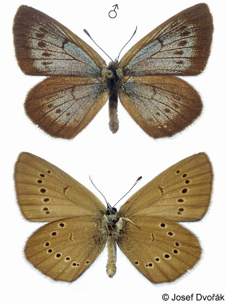
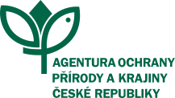

## About me {#about-me .tight}

::: {.card-green}
**Biodiversity Monitoring Specialist**, Department of Biodiversity Monitoring, Nature Conservation Agency of the Czech Republic (NCA CR).
:::

- **Background** – MSci Zoology (2022), supervised by Prof. Jason Matthiopoulos, University of Glasgow, UK
- **Current role** – supporting the digital transformation of conservation management through semi-automated site condition assessment within the **Nature Conservation Information System**
- **BiodivPond** – responsible for coordinating and leading the Biodiversa+ BiodivPond pilot
- **Experience I bring** – 6+ years of data analysis and management, sensor-based biodiversity monitoring, and international collaboration within **Biodiversa+ WP2**
- **Toolkit** – [field surveys]{.chip} [R]{.chip} [spatial analysis]{.chip} [long-term monitoring]{.chip}

## MSci thesis – in brief {#msci}

:::: {.columns}
::: {.column width="27%"}
{.species-photo}

::: {.fine .muted}
*Phengaris nausithous*
:::
:::
::: {.column width="73%"}
**Modelling the Effects of Resource Occurrence on the Metapopulation Dynamics of an Endangered Butterfly** · 2022

- A butterfly whose life cycle depends on the foodplant *Sanguisorba officinalis* and *Myrmica* spp. host ants
- 126 habitat patches in the Křivoklátsko Protected Landscape Area, modelled as a metapopulation through patch persistence and colonisation
- A **Bayesian model fitted in JAGS**, built from the national **Species Occurrence Database** and **Habitat Mapping Database** rather than from field survey
:::
::::

**Tools** – [Bayesian hierarchical models]{.chip} [JAGS / MCMC]{.chip} [R · sf]{.chip} [spatial data]{.chip}

## Proposed doctoral project {.divider background-color="#4C7D31"}

::: {.divider-sub}
**Monitoring methods for amphibian species of European importance in small water bodies and the assessment of their population status in the Czech Natura 2000 network**
:::

## Aim and outputs {#aim}

::: {.card-yellow}
A **critical evaluation of traditional and novel methods** for monitoring the status of amphibian populations and habitats, including their **applicability for practical nature conservation**, and the **assessment of amphibian population status** in the Czech Natura 2000 network after seven years of standardised monitoring.
:::

### Aims
- Compare **detection success** of eDNA and PAM against conventional field methods
- Test their reliability for **screening habitat quality** and detecting Annex II flagship species
- Inform conservation on the **best methods for monitoring and management** of amphibian populations and habitats

## Aim and outputs {#outputs}

::: {.card-yellow}
A **critical evaluation of traditional and novel methods** for monitoring the status of amphibian populations and habitats, including their **applicability for practical nature conservation**, and the **assessment of amphibian population status** in the Czech Natura 2000 network after seven years of standardised monitoring.
:::

### Outputs
- **Scientific publications** on the method comparison
- **Recommendations** for biodiversity observation, and the **limits** of both approaches
- **Evaluation of amphibian status** in the Czech Natura 2000 network after seven years of standardised data

## The methods compared {#comparison}

:::: {.columns}
::: {.column width="50%"}
::: {.card-brown}
**Conventional**

- **Umbrella trapping** – amphibians, identification in the field
- **Sweep-netting** – amphibians and aquatic macroinvertebrates with centralised morphological identification by experts
:::
:::
::: {.column width="50%"}
::: {.card-blue}
**Novel**

- **eDNA metabarcoding** – amphibians, fish and aquatic macroinvertebrates from one sample
- **ddPCR** – targeted assay for *Triturus* spp.
- **PAM** – bats, and calling amphibians (*Pelophylax* spp., *Hyla* spp., *Bombina* spp.)
:::
:::
::::

::: {.card-green}
At the **60 BiodivPond core ponds**, amphibians and fish are surveyed by **eDNA including a quality check, *Triturus* spp. abundance estimation, and traditional sampling** – the same ponds, the same date.
:::

::: {.small .muted}
An inter-laboratory ring test on identical eDNA samples runs alongside to establish consistency in extraction, amplification and species detection.
:::

## [1]{.strand-num} Method comparison {#h1}

::: {.card-blue}
[H1]{.hyp} Compared over a **single trapping event**, eDNA detects **most of the species present** better than umbrella traps.
:::

::: {.card-green}
[H1b]{.hyp} For **those species with similar detection rates**, ddPCR and umbrella trap results will **correlate** – and umbrella traps can therefore be used to **calibrate ddPCR**.
:::

- Paired eDNA and traditional sampling at the same ponds, with **repeated traditional sampling** for *Triturus* spp. abundance
- The workplan already provides for **crested newt ddPCR** and a multimarker assay in the laboratory analysis
- Sites with both eDNA and expert data serve as testbeds for **detection accuracy, cost-effectiveness and data complementarity**

::: {.notes}
H1 and H1b are the hypotheses as stated. The supporting bullets come from workplan §4.1 (Module 1) and the lab contributor budget line.
:::

## [2]{.strand-num} Seven years of standardised monitoring {#h2}

::: {.card-blue}
[H2]{.hyp} **Both local and landscape factors** play a significant role in amphibian population trends – with **management more important at smaller, more isolated sites**.
:::

:::: {.columns}
::: {.column width="50%"}
### Local
- Management
- Hydrology
- Fish presence
:::
::: {.column width="50%"}
### Landscape
- Land cover
- Land use
- Connectivity
:::
::::

::: {.card-yellow}
Testing this hypothesis will utilise data from 7+ years of a standardised monitoring scheme in the Czech Natura 2000 network. It will focus on **analysing the relationship between population trends, site characteristics, management practices, land cover and land use in the surrounding area**.
:::

::: {.notes}
H2 as stated. The framing sentence is from topic.md.
:::

## [3]{.strand-num} The BiodivPond pond network {#h3}

::: {.card-blue}
[H3]{.hyp} The role of **land cover is species-specific**.
:::

::: {.card-green}
[H3b]{.hyp} **Fish species associated with lower amphibian species richness** can be
identified – eDNA returns the fish community from the same water sample.
:::

- **560 ponds** sampled by eDNA – **60 core ponds** by active contributors and
  **500** through the citizen science scheme
- Across **different biogeographical regions of Europe**, temporary and permanent, with
  Natura 2000 sites prioritised but unprotected sites also included
- Biodiversity data are complemented by **pond nutrient status, vegetation coverage,
  surrounding land use and climatic variability**

## BiodivPond – funding, data and network {#funding}

::: {.map-card}
**Biodiversity monitoring of ponds** – *evaluating the applicability of novel methods and identification of obstacles to wide use.* A Biodiversa+ species sub-pilot coordinated by **NCA CR**.
:::

:::: {.columns}
::: {.column width="50%"}
::: {.card-green}
**The data**

- 560 ponds under one eDNA standardised protocol
- 60 ponds also covered by PAM and traditional sampling
- Centralised laboratory and bioinformatic analysis
- Open-access repository; data published via GBIF
:::
:::
::: {.column width="50%"}
::: {.card-blue}
**The network**

- Active contributors across at least 10 countries
- Dedicated lab, PAM and taxonomic analysis contributors
- Links to PONDERFUL, EuropaBON and other schemes
:::
:::
::::

::: {.small .muted}
Total EC contribution **€1,083,899**, of which **€104,000** for coordination at NCA CR.
:::

## Prospective LIFE {#life}

::: {.map-card}
A national-scale LIFE project coordinated by NCA CR, alongside which two species action
plans relevant to this project are planned:
:::

:::: {.columns}
::: {.column width="50%"}
::: {.card-green}
**National species action plan**

***Epidalea calamita***

- Active management of breeding sites
- Habitat restoration and creation
- Population monitoring and research: space for PAM, eDNA and traditional methods
:::
:::
::: {.column width="50%"}
::: {.card-blue}
**Regional species action plan**

***Lissotriton montandoni*** – Beskydy

- Habitat restoration and creation
- Population monitoring and research: space for eDNA and traditional methods
- Research on terrestrial habitat use and connectivity
:::
:::
::::

::: {.small .muted}
Both are instruments into which method recommendations and status assessments from this
project would feed directly.
:::

## Thank you {.divider background-color="#4C7D31"}

::: {.divider-sub}
Jonáš Gaigr · [jonas.gaigr@aopk.gov.cz](mailto:jonas.gaigr@aopk.gov.cz) ·
[{.orcid-logo} 0009-0004-0267-1382](https://orcid.org/0009-0004-0267-1382)
:::

::: {.logo-row}
{height="90"}
{height="90"}
{height="90"}
:::
